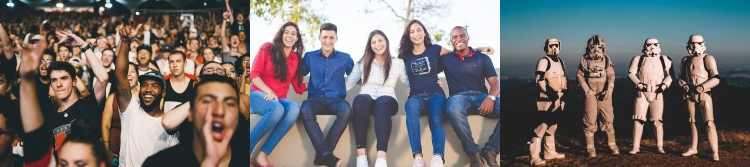
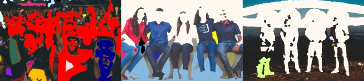
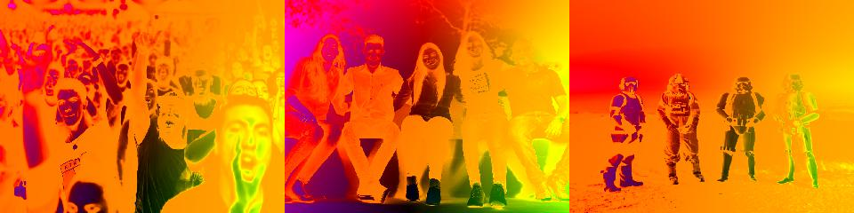
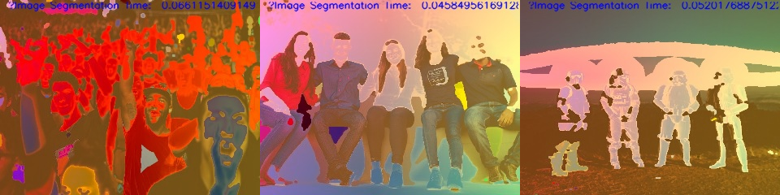

# Image segmentation and Optical Flow

The scenario has three images: 



**The below code executes the Region Growing Algorithm, and then the Optical Flow Estimation then finally the three images are combined in a new script `deterministic_stochastic.py` by interpolation.**

```bash

cd scripts/

python execute.py --image concert.jpg && \
python calculate_optical_flow.py --image concert.jpg && \
python execute.py --image group.jpg && \
python calculate_optical_flow.py --image group.jpg && \
python execute.py --image trooper.jpg && \
python calculate_optical_flow.py --image trooper.jpg && \
python deterministic_stochastic.py --det_coeff 0.6 --stoc_coeff 0.4

```

**Image Segmentation as a deterministic problem and Optical Flow as a stochastic problem**

Image Segmentation
------------------

**Segmentation of Image using Region Growing (Erosion/Dilation), and using OpenCV.**

**Region Growing is done using OpenCV which finally produces the markers that are tagged with color map presented in the code.**



Optical Flow
------------

**Calculating Optical Flow Derivatives of the Images given.**

**Optical Flow Estimation is done using SceneNet Deep Learning Model. Here is a another repository where a complex image has been derived from Optical Flow Derivatives to be represented as Amplitude of the image.**

[https://github.com/aswinvk28/optical-flow-analysis](https://github.com/aswinvk28/optical-flow-analysis)



Final Image after Interpolation
-------------------------------

**Final Interpolated Image from Optical Flow Model and Image Segmentation Model in OpenCV**

**A combination of Region Growing in OpenCV and Optical Flow will provide the resulting image which is an interpolated image**



Original Images
---------------

**These are the original images from which models were run**


