# Image segmentation and Optical Flow

```bash

python execute.py --image concert.jpg && python calculate_optical_flow.py --image concert.jpg && python execute.py --image group.jpg && python calculate_optical_flow.py --image group.jpg && python execute.py --image trooper.jpg && python calculate_optical_flow.py --image trooper.jpg && python deterministic_stochastic.py --det_coeff 0.6 --stoc_coeff 0.4

```

**Image Segmentation as a deterministic problem and Optical Flow as a stochastic problem**

Image Segmentation
------------------

**Segmentation of Image using Region Growing (Erosion/Dilation), and using OpenCV.**

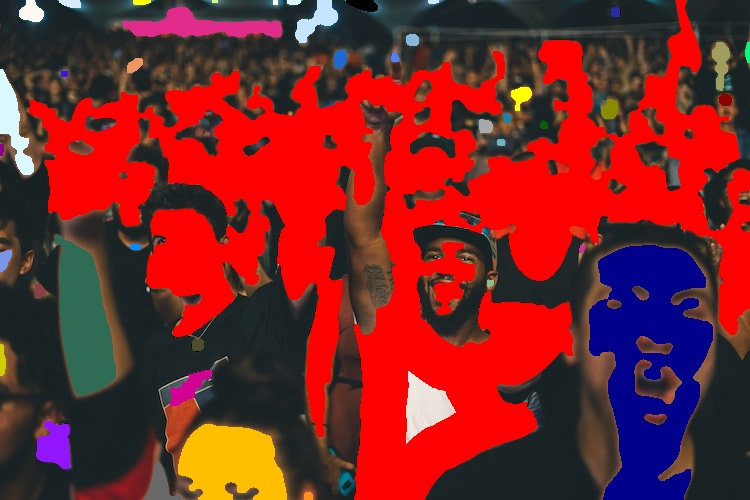

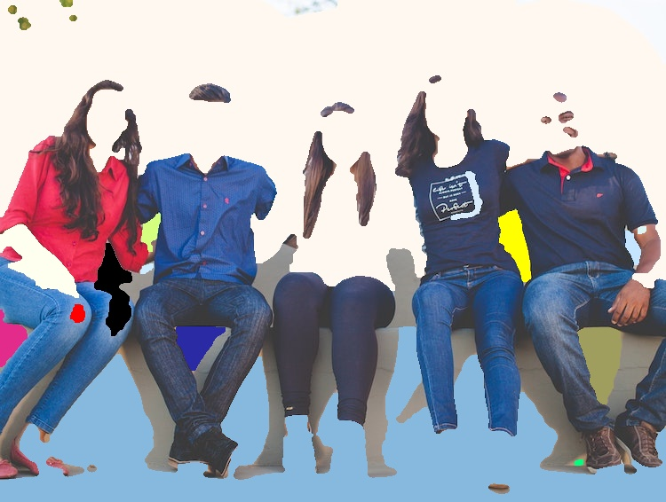

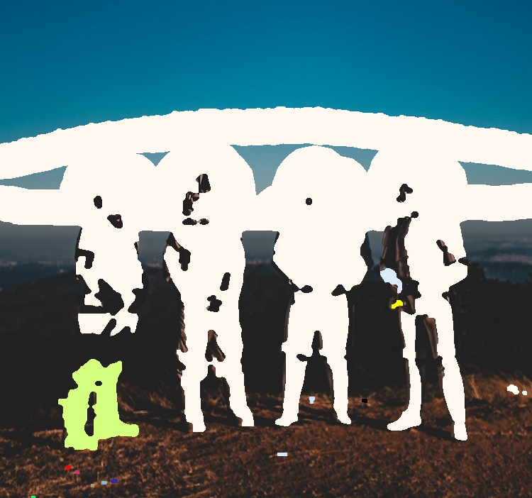

Optical Flow
------------

**Calculating Optical Flow Derivatives of the Images given**

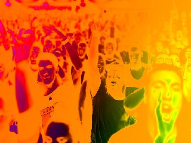

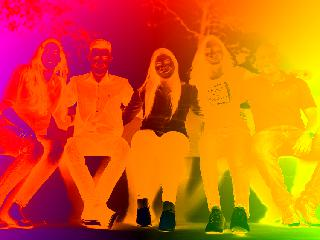

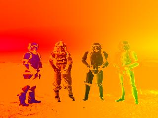

Final Image after Interpolation
-------------------------------

**Final Interpolated Image from Optical Flow Model and Image Segmentation Model in OpenCV**

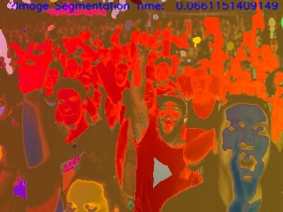

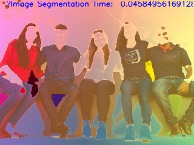

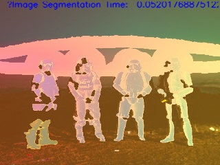

Original Images
---------------

**These are the original images from which models were run**

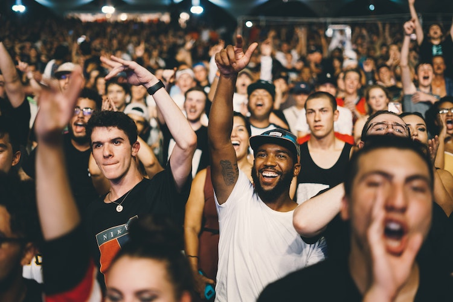

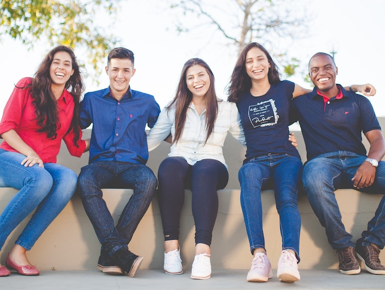

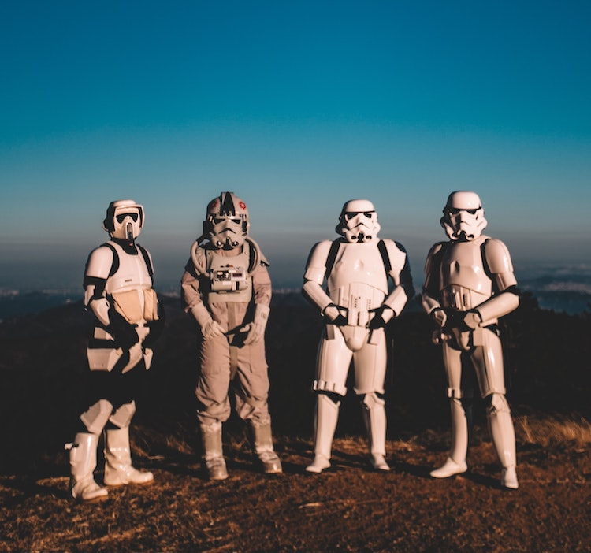
